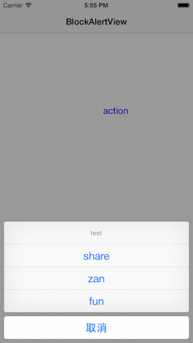

##步骤

1、初始化

```
BlockAlertView *alertView = [[BlockAlertView alloc] initWithTitle:@"test"];
```

2、添加title和block

```
[alertView addTitle:@"share" block:^(id result) {
        NSLog(@"share");
    }];
    [alertView addTitle:@"zan" block:^(id result) {
        NSLog(@"zan");
    }];
    [alertView addTitle:@"fun" block:^(id result) {
        NSLog(@"fun");
    }];
```

3、showInView

```
[alertView showInView:self.view];
```

4、alertView全局变量以免释放

```
_blockView = alertView;